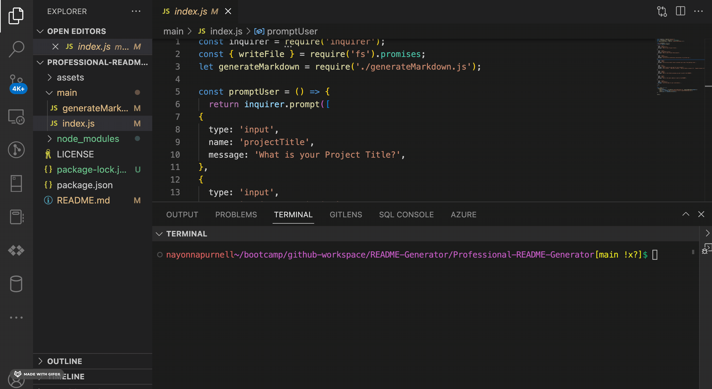

# Professional README Generator using Node.JS and ES6+

## Project Description
 ------
This tool provides an easy way to create a Project Repository README.

The README generator helps you provide information on how to use the app, how to install it, and how to make contributions so that other developers are more likely to use and contribute to the success of the project.

This is a command-line application that runs with Node.js that dynamically generates a README.md file based on input about your project.

## Table of Contents
  ------  
  - [Setup](#setup)
  - [Usage](#usage)
  - [License](#license)
  - [Author](#author)
  - [Contact](#contact)
  
 ## Setup 
  ------

  To generate your own README, git clone the repo down to your local computer.

  This generator requires node, npm, and inquirer.

  Check that you have node installed with the command.
  node -v

  Check that you have npm installed with the command.
  npm -v

  Next, run npm i in your terminal to get all the necessary node modules for your package.json file.

  The application will start by running node main.js in the command line.

  Answer the prompts in your command line to generate the README.

  After answering all the prompts, your README file will be named 'generateMarkdown.md' and will be ready for you at the root of the repo.

  ## Usage 
  ------

  

This will write a file, readme.md, to the local directory.

The README generator will ask you a set of questions, which will help it fill out the README. These are:

What is your Project Title?
What is your Project Description?
List out the installation instructions if you have any.
List out any useful links to prevent your users from getting stuck.
What license do you want for your project?
What is the Github username you want to add to the README?
What is the email address to add to the README?
List the names of your contributors.

  
  ## License
  ------
 A short and simple permissive license with conditions only requiring preservation of copyright and license notices. Licensed works, modifications, and larger works may be distributed under different terms and without source code.    [MIT License](https://choosealicense.com/licenses/mit/)  

   ## Author
  ------
  Nayonna Purnell

   ## Contact
  ------
  LinkedIn: https://www.linkedin.com/in/nayonnapurnell/
  Email:  nayonnapurnell@outlook.com

  ## Video Walkthrough
  ------

  